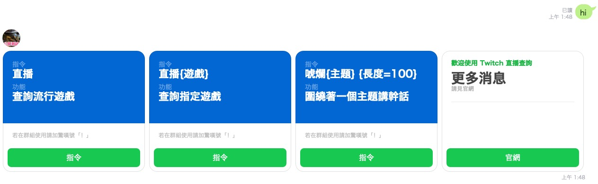

[](./packages/bot/CHANGELOG.md)

# 讓你輕鬆查詢 Twitch 正在直播的 LINE BOT 機器人

> 更多訊息請見
> https://www.notion.so/hilezi/d7ac6acf3ee94029a245be3df3c9f5fe

---

- [讓你輕鬆查詢 Twitch 正在直播的 LINE BOT 機器人](#讓你輕鬆查詢-twitch-正在直播的-line-bot-機器人)
  - [加入好友](#加入好友)
- [BOT](#bot)
  - [development](#development)
  - [deploy](#deploy)
- [WEB](#web)

---

| 預覽                                  |
| ------------------------------------- |
|  |

## 加入好友

| 正式站機器人                            | 公開測試機器人                            |
| --------------------------------------- | ----------------------------------------- |
|  |  |

# BOT

## development

> 需要三個 sessions 分別給 webpack build、npm test 和 bottender start 作測試。

```sh
npm run dev:watch -- --watch
```

```sh
npm run test -- --verbose --watch
```

```sh
DEBUG=bottender*,-messaging-api*,-bottender:session*-bottender:response,w3r* npx bottender start

# 或

npm run dev:console
```

## deploy

```sh
# 部署到 ZEIT Now 公開測試機器人
npm run deploy
```

```sh
# 部署到 ZEIT Now 正式站
npm run deploy:prod
```

# WEB

```sh
now dev
```
