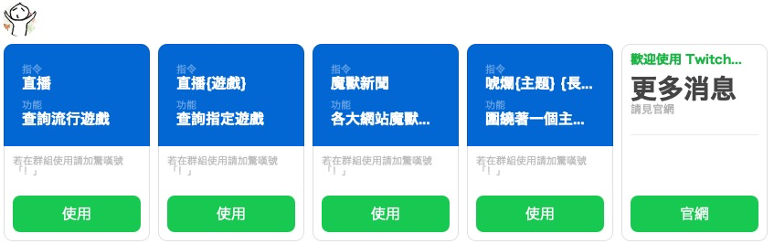
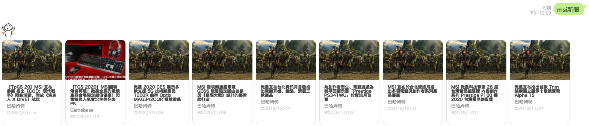
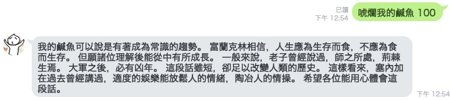

[](./packages/bot/CHANGELOG.md)

# 這個 LINE BOT 機器人

> 不知道可以幹嘛，反正它就出生了
>
> https://www.notion.so/hilezi/d7ac6acf3ee94029a245be3df3c9f5fe

---

- [這個 LINE BOT 機器人](#這個-line-bot-機器人)
  - [加入好友](#加入好友)
- [BOT](#bot)
  - [development](#development)
  - [deploy](#deploy)

---

| 預覽                                  |
| ------------------------------------- |
|  |
|  |
|  |

## 加入好友

### LINE

| 正式站                            | 測試機人                            |
| --------------------------------------- | ----------------------------------------- |
|  |  |

### Telegram

[@itsthatbot](https://t.me/itsthatbot)

# BOT

## development

> 需要三個 sessions 分別給 webpack build、npm test 和 bottender start 作測試。

```sh
npm run dev:watch
```

```sh
npm run test -- --verbose --watch
```

```sh
npm run dev:server
```

## deploy

```sh
# 部署到 heroku 正式站
git push heroku master
```
