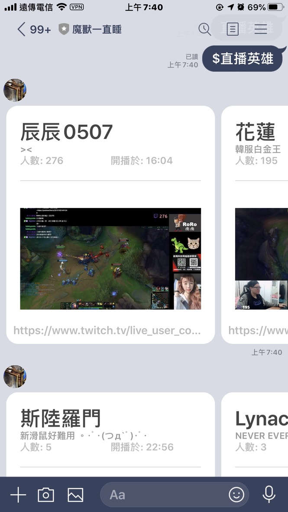

[](./CHANGELOG.md)

# 讓你輕鬆查詢 Twitch 正在直播的 LINE BOT 機器人

> https://www.notion.so/hilezi/d7ac6acf3ee94029a245be3df3c9f5fe



# development

## for WEB

```sh
now dev
```

## for BOT

> 需要兩個 process 一個給 webpack build，一個使用 bottender console 作測試。

```sh
npm run dev:watch
```

```sh
npm run dev:console
```
